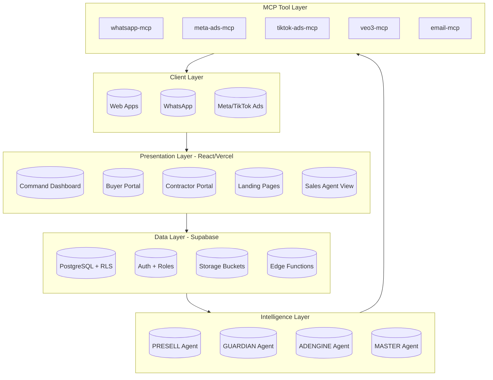

# DEVOS Implementation Plan

## Real Estate Development Operating System

**Version 1.0 | March 2026**

---

## Executive Summary

This document outlines the complete implementation plan for DEVOS - an AI-powered autonomous platform for real estate developers. The implementation spans **5 phases over 6 months**, with the first 3 phases delivering an operational product for Primerose Smart City Cluster (200 units), and phases 4-5 packaging it as a SaaS product.

**Key Decision Required Before Kick-off:**

- [ ] Resolve all 8 Open Questions in Section 14 of PRD
- [ ] Confirm team composition and agency partnerships

---

## Architecture Overview



---

## Phase 1: Foundation (Weeks 1-3)

**Goal: First lead captured and managed within DEVOS by end of Week 3**

### Sprint 1 (Week 1): Multi-Tenant Foundation + Landing Page

**This is the most critical sprint.** Multi-tenant architecture must be correct from day one.

| Task | Description | Agent Hand-off |
|------|-------------|----------------|
| T1.1 | Set up Supabase project with production configuration | **Backend Agent** |
| T1.2 | Build PLATFORM LAYER schema: `organisations`, `subscriptions`, `org_credentials`, `org_members`, `agent_context` | **Backend Agent** |
| T1.3 | Build ALL remaining tables with `organisation_id` as non-nullable FK | **Backend Agent** |
| T1.4 | Write RLS policies for every table with `get_user_org_id()` helper | **Backend Agent** |
| T1.5 | Configure Supabase Auth roles: `super_admin`, `org_admin`, `sales_agent`, `finance`, `site_manager`, `buyer`, `contractor` | **Backend Agent** |
| T1.6 | Configure Vercel wildcard subdomain routing | **Frontend Agent** |
| T1.7 | Build React subdomain routing with org context loading | **Frontend Agent** |
| T1.8 | Build landing page: hero, unit cards, payment calculator, lead form | **Frontend Agent** |
| T1.9 | Connect lead form to Supabase with UTM parsing | **Frontend Agent** |
| T1.10 | WhatsApp Business API setup: Meta Business account, phone, webhook | **Backend Agent** |
| T1.11 | Build whatsapp-mcp server with credential injection | **MCP Developer** |
| T1.12 | Build `on-lead-created` Edge Function | **Backend Agent** |
| T1.13 | Build `on-whatsapp-inbound` Edge Function | **Backend Agent** |
| T1.14 | Write PRESELL Agent system prompt with qualification flow | **AI Agent Developer** |
| T1.15 | Configure DEVOS Agent Engine with Claude API | **AI Agent Developer** |
| T1.16 | Create Primerose organisation record | **Backend Agent** |
| T1.17 | Deploy to Vercel at primerose.devos.app | **Frontend Agent** |

### Sprint 2 (Week 2): WhatsApp Qualification + Lead Management

| Task | Description | Agent Hand-off |
|------|-------------|----------------|
| T2.1 | Complete PRESELL Agent system prompt refinement | **AI Agent Developer** |
| T2.2 | Test multi-turn WhatsApp qualification end-to-end | **AI Agent Developer** + **QA** |
| T2.3 | Build lead scoring update logic via supabase-mcp | **AI Agent Developer** |
| T2.4 | Build sales agent dashboard: lead list, scores, profile view | **Frontend Agent** |
| T2.5 | Build hot lead notification system | **AI Agent Developer** |
| T2.6 | Build media library in Supabase Storage (renders, videos, PDFs) | **Backend Agent** |
| T2.7 | Build agent_logs viewer in developer dashboard | **Frontend Agent** |

### Sprint 3 (Week 3): Reservation + Buyer Portal (MVP)

| Task | Description | Agent Hand-off |
|------|-------------|----------------|
| T3.1 | Build reservation workflow: unit selection, payment instructions | **Frontend Agent** |
| T3.2 | Build unit inventory tracker with real-time status (Available/Reserved/Sold) | **Frontend Agent** |
| T3.3 | Build Buyer Portal MVP: payment progress bar, construction status | **Frontend Agent** |
| T3.4 | Build `on-payment-confirmed` Edge Function | **Backend Agent** |
| T3.5 | Build pdf-mcp for Reservation Letter generation | **MCP Developer** |
| T3.6 | Build payment tracking: receipt upload, finance workflow | **Frontend Agent** |
| T3.7 | Build Command Dashboard MVP: units, revenue, leads summary | **Frontend Agent** |
| T3.8 | Build payment reminder Edge Functions (7d, 3d) | **Backend Agent** |
| T3.9 | Write MASTER Agent system prompt for morning brief | **AI Agent Developer** |
| T3.10 | Build `morning-brief` Edge Function | **Backend Agent** |

### Phase 1 Acceptance Criteria

| Criteria | Verification Method |
|----------|---------------------|
| Lead form → Supabase + WhatsApp in <60s | End-to-end test |
| Qualification bot handles all flow states | Test each state transition |
| Lead scoring algorithm correct | Unit test with known inputs |
| Hot lead notification delivered | Live test with threshold |
| Full reservation flow functional | Complete reservation test |
| Buyer Portal displays correct data | Buyer UAT |
| Command Dashboard shows live metrics | Dashboard verification |

---

## Phase 2: GUARDIAN Core (Weeks 4-6)

**Goal: Every purchase request and invoice passes through GUARDIAN before developer approval**

### Sprint 4 (Week 4): Budget Setup + Purchase Request Flow

| Task | Description | Agent Hand-off |
|------|-------------|----------------|
| T4.1 | Build budget setup interface: phases, categories, amounts, contingency | **Frontend Agent** |
| T4.2 | Build BOQ and contract upload + parsing | **Backend Agent** |
| T4.3 | Build materials price index: initial dataset | **Backend Agent** |
| T4.4 | Build `price-index-update` Edge Function (monthly scraper) | **Backend Agent** |
| T4.5 | Build site manager mobile interface for purchase requests | **Frontend Agent** |
| T4.6 | Build `on-purchase-request` Edge Function | **Backend Agent** |
| T4.7 | Write GUARDIAN Agent system prompt | **AI Agent Developer** |
| T4.8 | Build developer approval interface | **Frontend Agent** |
| T4.9 | Build `on-approval-granted` Edge Function | **Backend Agent** |

### Sprint 5 (Week 5): Contractor Portal + Invoice Verification

| Task | Description | Agent Hand-off |
|------|-------------|----------------|
| T5.1 | Build Contractor Portal: login, invoice form, evidence uploads | **Frontend Agent** |
| T5.2 | Build `on-invoice-submitted` Edge Function | **Backend Agent** |
| T5.3 | Configure GUARDIAN Agent invoice analysis (6 checks) | **AI Agent Developer** |
| T5.4 | Build site manager verification step | **Frontend Agent** |
| T5.5 | Build invoice flag system with severity levels | **Backend Agent** |
| T5.6 | Build payment approval workflow chain | **Frontend Agent** |
| T5.7 | Build payment_tickets table and PDF generation | **Backend Agent** |
| T5.8 | Build finance notification via email-mcp | **MCP Developer** |

### Sprint 6 (Week 6): Budget Dashboard + JV Reports

| Task | Description | Agent Hand-off |
|------|-------------|----------------|
| T6.1 | Build GUARDIAN dashboard with all components | **Frontend Agent** |
| T6.2 | Build budget trend chart (actual vs planned) | **Frontend Agent** |
| T6.3 | Build Guardian Savings Tracker | **Frontend Agent** |
| T6.4 | Build cost-to-complete projection | **AI Agent Developer** |
| T6.5 | Build `weekly-jv-report` Edge Function | **Backend Agent** |
| T6.6 | Integrate GUARDIAN into Command Dashboard (Realtime) | **Frontend Agent** |
| T6.7 | Build contractor performance scoring | **Backend Agent** |
| T6.8 | Build mcp_tool_calls viewer | **Frontend Agent** |

### Phase 2 Acceptance Criteria

| Criteria | Verification Method |
|----------|---------------------|
| Purchase request → GUARDIAN analysis in <5 min | Timed test |
| Price flag raised correctly (>5% above market) | Test with above-market price |
| Invoice blocked if evidence incomplete | Attempt submission test |
| Rate discrepancy identified vs contract | Test with above-contract rate |
| Developer approval → Payment Ticket → Finance notified | Full workflow test |
| Weekly JV report delivered Monday 7am | Scheduled trigger test |
| Guardian Savings accumulated correctly | Cumulative test |

---

## Phase 3: Intelligence Layer (Weeks 7-10)

**Goal: Full AdEngine live, AI agents autonomous, predictive analytics active**

### Sprint 7 (Week 7): AdEngine - Campaign Management + Creative Factory

| Task | Description | Agent Hand-off |
|------|-------------|----------------|
| T7.1 | Build campaign setup interface (all fields) | **Frontend Agent** |
| T7.2 | Build audience template library | **Frontend Agent** |
| T7.3 | Build Magic Link tracking system (UTM generation, routing) | **Backend Agent** |
| T7.4 | Build meta-ads-mcp server | **MCP Developer** |
| T7.5 | Build tiktok-ads-mcp server | **MCP Developer** |
| T7.6 | Build veo3-mcp server for video generation | **MCP Developer** |
| T7.7 | Write ADENGINE Agent system prompt | **AI Agent Developer** |
| T7.8 | Build Creative Factory: copy variants, veo3 generation | **AI Agent Developer** |
| T7.9 | Build creative approval workflow | **Frontend Agent** |

### Sprint 8 (Week 8): AdEngine - Monitoring + Optimisation

| Task | Description | Agent Hand-off |
|------|-------------|----------------|
| T8.1 | Build `ad-performance-sync` Edge Function (every 6 hours) | **Backend Agent** |
| T8.2 | Build AdEngine performance dashboard | **Frontend Agent** |
| T8.3 | Build ADENGINE Agent 48-hour optimisation cycle | **AI Agent Developer** |
| T8.4 | Build ad fatigue detection | **AI Agent Developer** |
| T8.5 | Build retargeting audience automation | **MCP Developer** |
| T8.6 | Build Lookalike audience builder | **MCP Developer** |
| T8.7 | Build lead attribution tracking | **Backend Agent** |

### Sprint 9 (Week 9): Predictive Analytics + Master Agent

| Task | Description | Agent Hand-off |
|------|-------------|----------------|
| T9.1 | Build predictive overrun engine | **AI Agent Developer** |
| T9.2 | Build materials price trend monitoring | **Backend Agent** |
| T9.3 | Build cost-to-complete forecast | **AI Agent Developer** |
| T9.4 | Refine MASTER Agent for cross-module synthesis | **AI Agent Developer** |
| T9.5 | Build agent_logs full dashboard | **Frontend Agent** |
| T9.6 | Build mcp_tool_calls audit viewer | **Frontend Agent** |

### Sprint 10 (Week 10): Revenue Attribution + Reporting

| Task | Description | Agent Hand-off |
|------|-------------|----------------|
| T10.1 | Build revenue attribution report (monthly) | **AI Agent Developer** |
| T10.2 | Build lead-to-revenue traceability view | **Frontend Agent** |
| T10.3 | Build PRESELL analytics dashboard | **Frontend Agent** |
| T10.4 | Build final Command Dashboard | **Frontend Agent** |
| T10.5 | End-to-end integration testing | **QA Agent** |
| T10.6 | Performance optimisation | **Frontend Agent** |

---

## Phase 4: Polish & Completeness (Weeks 11-14)

**Goal: DEVOS fully production-ready for Primerose commercial launch**

| Task | Description | Agent Hand-off |
|------|-------------|----------------|
| T11.1 | Sale & Purchase Agreement auto-generation (10% threshold) | **Backend Agent** |
| T11.2 | E-signature integration (DocuSign/Zoho) | **MCP Developer** |
| T11.3 | Notice of Default auto-generation | **Backend Agent** |
| T11.4 | Contractor performance dashboard | **Frontend Agent** |
| T11.5 | Buyer upgrade module (smart home, interior fit-out) | **Frontend Agent** |
| T11.6 | Diaspora flow refinement | **AI Agent Developer** |
| T11.7 | Multi-language WhatsApp support | **AI Agent Developer** |
| T11.8 | Unit floor plan SVG viewer | **Frontend Agent** |
| T11.9 | Construction photo gallery | **Frontend Agent** |
| T11.10 | DEVOS mobile PWA | **Frontend Agent** |
| T11.11 | Comprehensive error handling | **Backend Agent** |
| T11.12 | Security audit + penetration testing | **Security Specialist** |
| T11.13 | UAT: 5 buyer journeys + 3 contractor journeys | **QA Agent** |
| T11.14 | Load testing: 200 concurrent sessions | **QA Agent** |

---

## Phase 5: SaaS Packaging (Months 4-6)

**Goal: DEVOS ready for commercial licensing to external developers**

### Multi-Tenancy Refinement

| Task | Description | Agent Hand-off |
|------|-------------|----------------|
| T12.1 | Full multi-tenant architecture review | **Backend Agent** |
| T12.2 | Organisation onboarding flow | **Frontend Agent** |
| T12.3 | White-label configuration | **Frontend Agent** |
| T12.4 | Instance isolation verification | **Security Specialist** |

### Subscription & Billing

| Task | Description | Agent Hand-off |
|------|-------------|----------------|
| T13.1 | Build subscription tiers: Starter/Growth/Enterprise | **Backend Agent** |
| T13.2 | Build Paystack integration (Nigeria) | **MCP Developer** |
| T13.3 | Build Stripe integration (international) | **MCP Developer** |
| T13.4 | Build usage metering | **Backend Agent** |
| T13.5 | Build client admin dashboard | **Frontend Agent** |

### Developer Onboarding

| Task | Description | Agent Hand-off |
|------|-------------|----------------|
| T14.1 | Guided onboarding wizard (<2 hours to first lead) | **Frontend Agent** |
| T14.2 | Template library (BOQ, contracts, documents) | **Backend Agent** |
| T14.3 | In-app help system | **Frontend Agent** |
| T14.4 | Onboarding support workflow | **AI Agent Developer** |

### SaaS Launch

| Task | Description | Agent Hand-off |
|------|-------------|----------------|
| T15.1 | Marketing website | **Marketing Team** |
| T15.2 | Case study documentation | **Product Team** |
| T15.3 | Pricing page + demo booking | **Marketing Team** |
| T15.4 | Developer outreach (10 targets) | **Sales Team** |

---

## Agent Hand-off Specifications

### A. Frontend React Development Hand-off

**Who handles:** Frontend-focused developer

**Deliverables:**

- React 18 + TypeScript + Vite + Tailwind CSS + shadcn/ui application
- Subdomain routing for multi-tenant ([slug].devos.app)
- All user-facing interfaces:
  - Command Dashboard
  - Buyer Portal
  - Contractor Portal
  - Sales Agent View
  - Landing Pages
  - Super Admin Panel

**Input from this plan:**

- Wireframes/mockups from UI/UX designer
- API contracts from backend
- Component library specifications

---

### B. Backend/Supabase Development Hand-off

**Who handles:** Backend-focused developer with Supabase expertise

**Deliverables:**

- All database schema with organisation_id on every table
- RLS policies enforced at database level
- Supabase Auth configuration (all 7 roles)
- All Edge Functions (deterministic event routing)
- Storage bucket configuration

**Key tables:**

- organisations, subscriptions, org_credentials, org_members, agent_context
- projects, units
- leads, buyers, reservations, payments_in, documents, whatsapp_threads
- campaigns, ad_sets, ad_creatives, ad_performance, lead_attribution
- budget_phases, price_index, purchase_requests, invoices, invoice_flags
- approvals, payment_tickets, contractors, progress_updates
- notifications, agent_logs, mcp_tool_calls

---

### C. AI Agent Development Hand-off

**Who handles:** AI/ML developer with Claude API experience

**Deliverables:**

- 4 specialized agents with system prompts:
  - **PRESELL Agent**: Qualification flow, lead scoring, diaspora logic
  - **GUARDIAN Agent**: Purchase request analysis, invoice verification, flag generation
  - **ADENGINE Agent**: Campaign optimization, creative generation, fatigue detection
  - **MASTER Agent**: Morning brief synthesis, cross-module coordination
- Agent context management per organisation
- agent_logs integration

**System prompts required:**

- Qualification flow states (INTAKE → QUALIFYING → EDUCATING → OBJECTION → HOT → APPOINTMENT → RESERVATION → COLD → DEAD)
- Lead scoring algorithm (10 signal categories)
- Flag severity levels (CLEAR, INFO, WARNING, CRITICAL)
- Agent permission boundaries (CAN vs CANNOT)

---

### D. MCP Server Development Hand-off

**Who handles:** Backend developer with API integration experience

**Deliverables:**

- **whatsapp-mcp**: Send text/media/docs, read incoming, template messages
- **meta-ads-mcp**: Read performance, pause/resume ad sets, adjust daily budget (±40%)
- **tiktok-ads-mcp**: Read metrics, pause/resume, adjust bids
- **veo3-mcp**: Generate video from prompt + renders, pending approval workflow
- **email-mcp**: Send JV reports, documents, notifications (via Resend)
- **pdf-mcp**: Generate documents from templates (Edge Function)

**Credential flow:**

- Per-org credentials stored in Supabase Vault
- MCP retrieves credentials at call time for specific organisation_id
- No cross-org credential access

---

### E. UI/UX Design Hand-off

**Who handles:** UI/UX Designer (Figma)

**Deliverables:**

- Figma mockups for all interfaces:
  - Command Dashboard (all rows/components)
  - Buyer Portal (all sections)
  - Contractor Portal
  - Sales Agent View
  - Landing Page (mobile-optimized)
  - Authentication flows
- Component library documentation
- Design system with Tailwind tokens

**Timeline:** Sprint 1-2 for initial mocks, ongoing refinement

---

### F. QA & Testing Hand-off

**Who handles:** QA Engineer (Phase 3+)

**Deliverables:**

- End-to-end test plans
- UAT coordination
- Load testing (200 concurrent sessions)
- Security penetration testing
- Agent behavior regression testing

**Test scenarios:**

- 5 simulated buyer journeys
- 3 simulated contractor invoice journeys
- 1 full campaign cycle
- All acceptance criteria verification

---

## Open Questions Requiring Decisions

These must be resolved before or during Phase 1:

| # | Question | Impact | Recommendation |
|---|----------|--------|---------------|
| D1 | E-signature provider? | Phase 4 | DocuSign (industry standard) or Zoho Sign (cost-effective) |
| D2 | WhatsApp number configuration | Phase 1 Sprint 1 | Dedicated Primerose number |
| D3 | Payment confirmation method | Phase 1 Sprint 3 | Manual finance confirmation initially |
| D4 | Materials price index source | Phase 2 Sprint 4 | Build proprietary scraper for Nigerian market |
| D5 | JV report distribution | Phase 2 Sprint 6 | Email initially, dashboard access later |
| D6 | Buyer portal domain | Phase 1 | devos.primerose.ng |
| D7 | SaaS billing currency | Phase 5 | Dual ₦/$ with Paystack + Stripe |
| D8 | Data residency | Now | Supabase US acceptable for MVP |

---

## Team Composition (Recommended)

| Role | Responsibility | Phase Involvement |
|------|----------------|-------------------|
| Lead Full-Stack Developer | React, Supabase, Edge Functions, architecture | All phases |
| AI/Agent Developer | Agent configuration, MCP servers, prompts | All phases |
| Backend Developer | MCP servers, Edge Functions, API integrations | All phases |
| Frontend Developer | React components, dashboards, portals | All phases |
| UI/UX Designer | Figma mockups, design system | Phase 1-2 |
| QA Engineer | E2E testing, UAT, load testing | Phase 3+ |

---

## Risk Assessment

| Risk | Probability | Impact | Mitigation |
|------|-------------|--------|------------|
| Multi-tenant RLS complexity | High | High | Extensive Sprint 1 testing |
| WhatsApp API rate limits | Medium | Medium | Queue system, fallback email |
| Claude API latency | Medium | Medium | OpenRouter fallback |
| Ad platform API changes | Low | Medium | Version pinning, monitoring |
| Data migration issues | Low | High | Seed data, rollback plans |

---

## Success Metrics

| Phase | Metric | Target |
|-------|--------|--------|
| Phase 1 | First lead captured | Week 3 |
| Phase 1 | Units pre-sold | 40 in 60 days |
| Phase 2 | GUARDIAN savings captured | ₦10M+ in Phase 1 |
| Phase 3 | Lead-to-reservation rate | >8% |
| Phase 3 | Developer daily time | <20 minutes |
| Phase 5 | First external client | Month 4 |
| Phase 5 | Paying clients by Month 6 | 3 minimum |
| Phase 5 | MRR by Month 12 | ₦4M/month |

---

## Implementation Timeline Summary

```
Month 1 (Weeks 1-4):   ████████░░░░░░░░░░░░░  Phase 1 (Sprint 1-2)
Month 2 (Weeks 5-8):   ██████████████░░░░░░  Phase 1-2 (Sprint 3-5)
Month 3 (Weeks 9-12):  ████████████████░░░  Phase 2-3 (Sprint 6-8)
Month 4 (Weeks 13-16): █████████████████░░  Phase 3 (Sprint 9-10)
Month 5 (Weeks 17-20): ███████████████████  Phase 4 (Polish)
Month 6 (Weeks 21-24): ███████████████████  Phase 5 (SaaS Launch)
```

---

*Document Version: 1.0*
*Created: March 2026*
*For: LawOne Cloud LLC*
